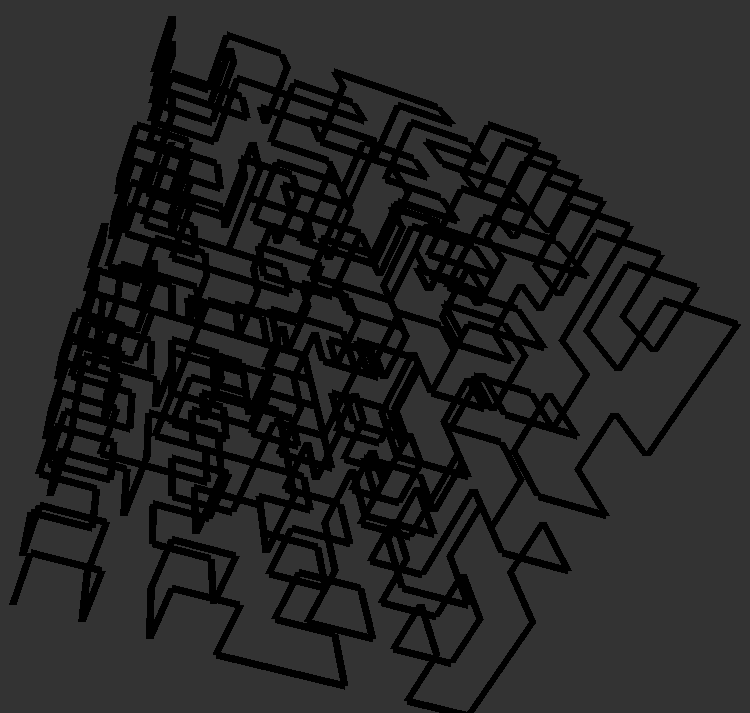
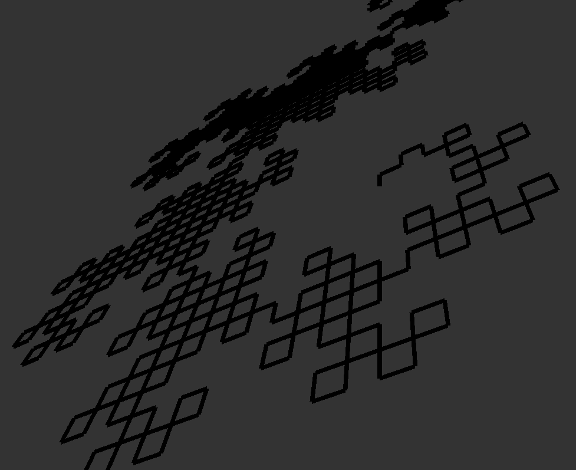
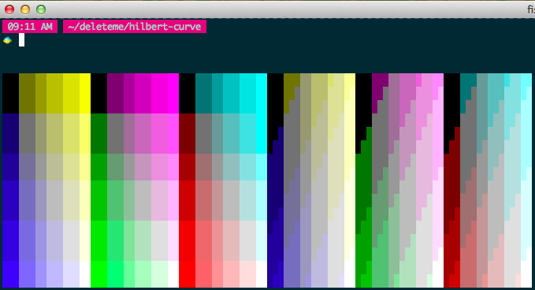
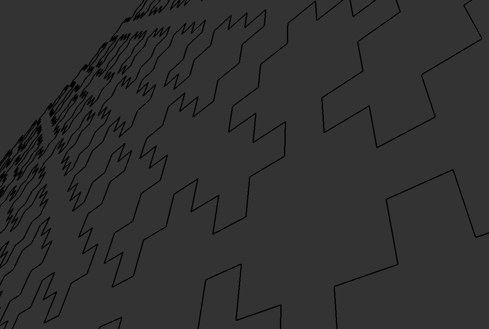
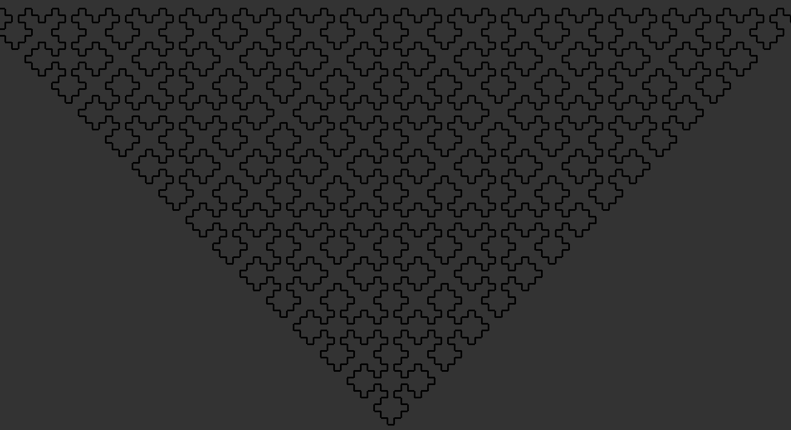

Hilbert Curve
=============

Hilbert cube




Dragon curve




Without spacing between, using it to choose colours




Watch it draw


Watch it draw again, this one looks more like a Hilbert curve b/c I spaced the vertices.


Make it tweetable!

<https://twitter.com/josh_cheek/status/667502337812860929>

```sh
ruby -e's=?F;3.times{s.gsub!?F,"F3F1F1F3F"};puts"\e[30H\e[47m#{s.gsub(/./){$.+=$&.to_i;"\e[#{%w[2C B 2D A][$.%4]}  \e[2D"*2if$&[?F]}}\e[m"'
```

<https://twitter.com/josh_cheek/status/760532928803672064>

```sh
ruby -e 'r=1..4;3.times{r=r.flat_map{|n|[0,0,1,2,3,0,0].map{|m|n+m}}};$><<r.map{|n|"\e[42m  \e[2D\e[#{n%2*2}#{"ACBD"[n%4]}"*2}*""<<"\e[59H"'
```


32 Segment curve


Square curve





Resources
---------

* Paper on 3d Hilbert curves [http://arxiv.org/pdf/1109.2323v1.pdf](http://arxiv.org/pdf/1109.2323v1.pdf)
* Representing a 3d Hilbert curve as an Lsystem [http://math.stackexchange.com/questions/123642/representing-a-3d-hilbert-curve-as-an-l-system](http://math.stackexchange.com/questions/123642/representing-a-3d-hilbert-curve-as-an-l-system)
  This is the definition I actually used

  ```javascript
  lsystem Hilbert3D {

      set iterations = 3;
      set symbols axiom = X;

      interpret F as DrawForward(10);
      interpret + as Yaw(90);
      interpret - as Yaw(-90);
      interpret ^ as Pitch(90);
      interpret & as Pitch(-90);
      interpret > as Roll(90);
      interpret < as Roll(-90);
      rewrite X to ^ < X F ^ < X F X - F ^ > > X F X & F + > > X F X - F > X - >;
  }
  ```
* Hilbert curves you can draw [https://bentrubewriter.wordpress.com/2012/04/26/fractals-you-can-draw-the-hilbert-curve-or-what-the-labyrinth-really-looked-like/](https://bentrubewriter.wordpress.com/2012/04/26/fractals-you-can-draw-the-hilbert-curve-or-what-the-labyrinth-really-looked-like/)
  Provides Lsystems for a number of different 2d curves:
  * Hilbert
    - Axiom: A
    - A -> - B F + A F A + F B -
    - B -> + A F - B F B - F A +
  * Sierpinski Triangle
    - Axiom A
    - A -> B-A-B
    - B -> A+B+A
    - In this case we rotate 60 degrees with every turn, and A and B are both used to mean draw a line forward
  * Koch Curve
    - Axiom F++F++F
    - F -> F-F++F-F
    - Use 60 degree turns
  * Dragon Curve L-System:
    - Axiom: FX
    - X -> X+YF
    - Y -> FX-Y
    - Use 90 degree turns
  * Quadratic Fractal:
    - Axiom: F+F+F+F
    - F -> F+F-F
    - Use 90 degree turns
  * Koch Curve Variant:
    - Axiom = F
    - F -> F+F-F-F+F
    - Use 90 degree turns
  * Fractal Plant:
    - Axiom: X
    - X -> F-[[X]+X]+F[+FX]-X
    - F -> FF
    - Use 25 degree turns. When you encounter a ‘[‘ save the current angle and position
      and restore when you see ‘]’. This is an example of a recursive L-System.
* A bunch of 2d curves, plus some code for Hilbert in Mathematmica [http://mathforum.org/advanced/robertd/lsys2d.html](http://mathforum.org/advanced/robertd/lsys2d.html)
  - Koch curve (F -> F+F--F+F, 60°):
  - 32-segment curve (F -> -F+F-F-F+F+FF-F+F+FF+F-F-FF+FF-FF+F+F-FF-F-F+FF-F-F+F+F-F+)
  - Hilbert curve (L -> +RF-LFL-FR+, R -> -LF+RFR+FL-)
  - Arrowhead curve (X -> YF+XF+Y, Y -> XF-YF-X, 60°)
  - Dragon curve (X -> X+YF+, Y -> -FX-Y)
  - Hilbert curve II (X -> XFYFX+F+YFXFY-F-XFYFX, Y -> YFXFY-F-XFYFX+F+YFXFY)
  - Peano-Gosper curve (X -> X+YF++YF-FX--FXFX-YF+, Y -> -FX+YFYF++YF+FX--FX-Y, 60°)
  - Peano curve (F -> F+F-F-F-F+F+F+F-F)
  - Quadratic Koch island (F -> F-F+F+FFF-F-F+F)
  - Square curve (X -> XF-F+F-XF+F+XF-F+F-X)
  - Sierpinski triangle (F -> FF, X -> --FXF++FXF++FXF--, 60°)
* The algorithmic beauty of plants [http://algorithmicbotany.org/papers/#abop](http://algorithmicbotany.org/papers/#abop)
* Someone's 3d Hilbert curve for Processing [http://martinpblogformasswritingproject.blogspot.com/2011/06/3d-hilbert-fractal-in-pyprocessing.html](http://martinpblogformasswritingproject.blogspot.com/2011/06/3d-hilbert-fractal-in-pyprocessing.html)
* Someone's 3d Hilbert curve for Mathematica [http://robertdickau.com/lsys3d.html](http://robertdickau.com/lsys3d.html)
* Some nice 2d Hilbert curve results [https://lustrebox.wordpress.com/2012/06/17/fractals/](https://lustrebox.wordpress.com/2012/06/17/fractals/)

License
-------

[Just do what the fuck you want to](http://www.wtfpl.net/about/)
